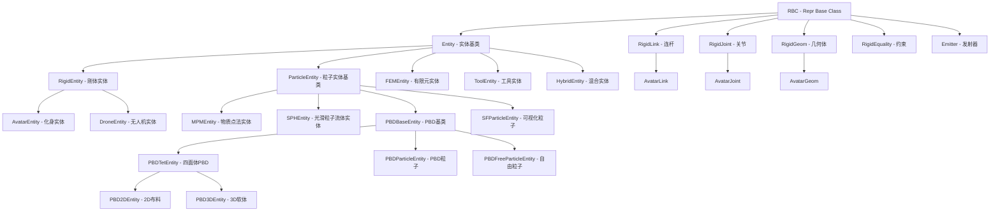

# Genesis Entities 模块概览
## Module Overview
本文档提供 `genesis/engine/entities` 模块的全面概览，包括代码行数统计、继承关系和架构图。
## 1. 实体类型分类 (Entity Classification)
### 1.1 代码行数统计 (Lines of Code Statistics)
| Entity Type | Files | Total Lines | Code Lines | Docstrings | Components |
|-------------|-------|-------------|------------|------------|------------|
| **RIGID** | 5 | 5545 | 3183 | 1472 | rigid_equality, rigid_link, rigid_entity, rigid_geom, rigid_joint |
| **AVATAR** | 4 | 266 | 143 | 95 | avatar_link, avatar_joint, avatar_entity, avatar_geom |
| **TOOL** | 2 | 739 | 557 | 24 | tool_entity, mesh |
| **FEM** | 1 | 1050 | 502 | 331 | fem_entity |
| **MPM** | 1 | 598 | 292 | 221 | mpm_entity |
| **PBD** | 1 | 678 | 412 | 173 | pbd_entity |
| **SPH** | 1 | 205 | 101 | 71 | sph_entity |
| **PARTICLE** | 1 | 894 | 458 | 276 | particle_entity |
| **HYBRID** | 1 | 738 | 433 | 139 | hybrid_entity |
| **DRONE** | 1 | 152 | 82 | 42 | drone_entity |
| **BASE** | 1 | 174 | 55 | 87 | base_entity |
| **OTHER** | 2 | 349 | 182 | 99 | emitter, sf_entity |
| **TOTAL** | 21 | 11388 | 6400 | - | - |

### 1.2 继承关系架构图 (Inheritance Architecture)

### 1.3 复杂实体构成 (Complex Entity Composition)

#### 1.3.1 RigidEntity (刚体实体) 构成
RigidEntity 是最复杂的实体类型，采用组件化设计：

- **RigidLink (连杆)**: 表示刚体部件，包含质量、惯性、位置等属性
  - 代码行数: 747 行 (432 行代码)
  - 核心功能: 运动学状态、动力学属性、坐标变换
- **RigidJoint (关节)**: 连接连杆，定义运动约束和自由度
  - 代码行数: 475 行 (250 行代码)
  - 核心功能: 关节类型（旋转、平移、球形等）、限位、控制
- **RigidGeom (几何体)**: 碰撞和视觉几何
  - 代码行数: 1,129 行 (646 行代码)
  - 核心功能: 碰撞检测、几何查询、可视化网格
- **RigidEquality (约束)**: 等式约束
  - 代码行数: 158 行 (71 行代码)
  - 核心功能: 焊接约束、附着点约束
- **RigidEntity (主体)**: 协调所有组件
  - 代码行数: 3,041 行 (1,784 行代码)
  - 核心功能: 实体管理、状态查询、正逆运动学

#### 1.3.2 AvatarEntity (化身实体) 构成
继承自 RigidEntity，增加了人形角色特有功能：

- **AvatarEntity**: 197 行 (91 行代码)
- **AvatarLink**: 46 行 (39 行代码)
- **AvatarJoint**: 11 行 (5 行代码)
- **AvatarGeom**: 16 行 (8 行代码)
- 特性: 动作捕捉驱动、VR/AR 应用支持

#### 1.3.3 ToolEntity (工具实体) 构成
基于网格的可控工具：

- **ToolEntity**: 532 行 (404 行代码)
- **Mesh**: 209 行 (153 行代码)
- 特性: 直接位姿控制、速度控制、适合机器人末端执行器

### 1.4 所有实体覆盖清单 (Complete Entity List)

| # | Entity | Type | Lines | Description |
|---|--------|------|-------|-------------|
| 1 | Entity | Base | 174 | 所有实体的基类 |
| 2 | RigidEntity | Rigid | 3040 | 刚体实体，支持多关节机器人 |
| 3 | AvatarEntity | Rigid | 196 | 人形化身实体 |
| 4 | DroneEntity | Rigid | 152 | 无人机实体 |
| 5 | ToolEntity | Tool | 531 | 工具/夹爪实体 |
| 6 | ParticleEntity | Particle | 894 | 粒子实体基类 |
| 7 | MPMEntity | Particle | 598 | 物质点法实体 |
| 8 | SPHEntity | Particle | 205 | 光滑粒子流体实体 |
| 9 | PBDBaseEntity | Particle | 678 | 位置动力学基类 |
| 10 | FEMEntity | FEM | 1050 | 有限元实体 |
| 11 | HybridEntity | Hybrid | 738 | 刚柔混合实体 |
| 12 | Emitter | Utility | 306 | 粒子发射器 |
| 13 | SFParticleEntity | Particle | 43 | 可视化粒子实体 |

---
*生成时间: 2025-10-26*
