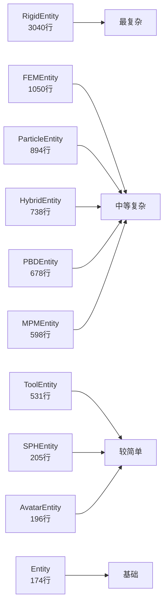

# Entities 代码分布分析
## Code Distribution Analysis
本文档分析各个 entity 的代码分布比例，包括通用功能、特殊函数、计算细节和辅助性函数。

## Base Entity
**总行数**: 174 | **代码行数**: 55 | **文档行数**: 87

### 函数分类统计

| 类别 | 数量 | 占比 | 说明 |
|------|------|------|------|
| 基础功能 | 9 | 100.0% | 属性、getter/setter 等基础接口 |

### 代表性函数示例

**基础功能** (9 个):
- `uid`
- `idx`
- `scene`
- `sim`
- `solver`
- `surface`
- `morph`
- `material`
- `is_built`

---

## Rigid Entity
**总行数**: 3040 | **代码行数**: 1784 | **文档行数**: 793

### 函数分类统计

| 类别 | 数量 | 占比 | 说明 |
|------|------|------|------|
| 基础功能 | 101 | 78.9% | 属性、getter/setter 等基础接口 |
| 特殊函数 | 9 | 7.0% | 实体特性相关的核心函数 |
| 计算细节 | 5 | 3.9% | 中间量计算、数值求解函数 |
| 辅助函数 | 13 | 10.2% | 内部辅助、工具函数 |

### 代表性函数示例

**基础功能** (101 个):
- `get_jacobian`
- `get_joint`
- `get_link`
- `get_pos`
- `get_quat`
- `get_vel`
- `get_ang`
- `get_links_pos`
- `get_links_quat`
- `get_AABB`
- ... 还有 91 个

**特殊函数** (9 个):
- `inverse_kinematics`
- `inverse_kinematics_multilink`
- `forward_kinematics`
- `plan_path`
- `control_dofs_force`
- `control_dofs_velocity`
- `control_dofs_position`
- `zero_all_dofs_velocity`
- `detect_collision`

**计算细节** (5 个):
- `_kernel_get_free_verts`
- `_kernel_get_fixed_verts`
- `_kernel_get_jacobian`
- `_kernel_get_jacobian_zero`
- `_kernel_forward_kinematics`

**辅助函数** (13 个):
- `_load_model`
- `_update_child_idxs`
- `_load_primitive`
- `_load_mesh`
- `_load_terrain`
- `_load_scene`
- `_build`
- `_init_jac_and_IK`
- `_add_by_info`
- `_add_equality`
- ... 还有 3 个

---

## Avatar Entity
**总行数**: 196 | **代码行数**: 91 | **文档行数**: 92

### 函数分类统计

| 类别 | 数量 | 占比 | 说明 |
|------|------|------|------|
| 特殊函数 | 3 | 100.0% | 实体特性相关的核心函数 |

### 代表性函数示例

**特殊函数** (3 个):
- `add_link`
- `add_joint`
- `init_jac_and_IK`

---

## Tool Entity
**总行数**: 531 | **代码行数**: 404 | **文档行数**: 24

### 函数分类统计

| 类别 | 数量 | 占比 | 说明 |
|------|------|------|------|
| 基础功能 | 29 | 55.8% | 属性、getter/setter 等基础接口 |
| 衍生类功能 | 1 | 1.9% | 子类特有的扩展功能 |
| 特殊函数 | 22 | 42.3% | 实体特性相关的核心函数 |

### 代表性函数示例

**基础功能** (29 个):
- `get_frame`
- `set_frame`
- `set_frame_add_grad_pos`
- `set_frame_add_grad_quat`
- `set_frame_add_grad_vel`
- `set_frame_add_grad_ang`
- `get_state`
- `set_state`
- `set_init_state`
- `set_vel`
- ... 还有 19 个

**衍生类功能** (1 个):
- `pbd_collide`

**特殊函数** (22 个):
- `init_tgt_vars`
- `init_ckpt`
- `reset_grad`
- `save_ckpt_kernel`
- `load_ckpt_kernel`
- `save_ckpt`
- `load_ckpt`
- `substep_pre_coupling`
- `substep_pre_coupling_grad`
- `substep_post_coupling`
- ... 还有 12 个

---

## Fem Entity
**总行数**: 1050 | **代码行数**: 502 | **文档行数**: 331

### 函数分类统计

| 类别 | 数量 | 占比 | 说明 |
|------|------|------|------|
| 基础功能 | 29 | 56.9% | 属性、getter/setter 等基础接口 |
| 特殊函数 | 16 | 31.4% | 实体特性相关的核心函数 |
| 计算细节 | 1 | 2.0% | 中间量计算、数值求解函数 |
| 辅助函数 | 5 | 9.8% | 内部辅助、工具函数 |

### 代表性函数示例

**基础功能** (29 个):
- `set_position`
- `set_velocity`
- `set_actuation`
- `set_muscle`
- `get_state`
- `set_pos`
- `set_pos_grad`
- `set_vel`
- `set_vel_grad`
- `set_actu`
- ... 还有 19 个

**特殊函数** (16 个):
- `deactivate`
- `activate`
- `instantiate`
- `sample`
- `compute_pressure_field`
- `init_tgt_keys`
- `init_tgt_vars`
- `init_ckpt`
- `save_ckpt`
- `load_ckpt`
- ... 还有 6 个

**计算细节** (1 个):
- `_kernel_get_verts_pos`

**辅助函数** (5 个):
- `_add_to_solver`
- `_assert_active`
- `_sanitize_input_tensor`
- `_sanitize_input_verts_idx`
- `_sanitize_input_poss`

---

## Mpm Entity
**总行数**: 598 | **代码行数**: 292 | **文档行数**: 221

### 函数分类统计

| 类别 | 数量 | 占比 | 说明 |
|------|------|------|------|
| 基础功能 | 17 | 48.6% | 属性、getter/setter 等基础接口 |
| 特殊函数 | 6 | 17.1% | 实体特性相关的核心函数 |
| 计算细节 | 5 | 14.3% | 中间量计算、数值求解函数 |
| 辅助函数 | 7 | 20.0% | 内部辅助、工具函数 |

### 代表性函数示例

**基础功能** (17 个):
- `get_state`
- `get_frame`
- `set_particles_pos`
- `get_particles_pos`
- `set_particles_vel`
- `get_particles_vel`
- `set_particles_active`
- `get_particles_active`
- `set_actuation`
- `set_particles_actu`
- ... 还有 7 个

**特殊函数** (6 个):
- `assert_muscle`
- `wrapper`
- `init_tgt_keys`
- `add_grad_from_state`
- `process_input`
- `process_input_grad`

**计算细节** (5 个):
- `_kernel_add_frame_particles_pos_grad`
- `_kernel_add_frame_particles_vel_grad`
- `_kernel_add_frame_particles_C_grad`
- `_kernel_add_frame_particles_F_grad`
- `_kernel_add_frame_particles_Jp_grad`

**辅助函数** (7 个):
- `_add_to_solver`
- `_add_particles_to_solver`
- `_reset_grad`
- `_reset_frame_grad`
- `_set_particles_pos_grad`
- `_set_particles_vel_grad`
- `_set_particles_actu_grad`

---

## Pbd Entity
**总行数**: 678 | **代码行数**: 412 | **文档行数**: 173

### 函数分类统计

| 类别 | 数量 | 占比 | 说明 |
|------|------|------|------|
| 基础功能 | 14 | 42.4% | 属性、getter/setter 等基础接口 |
| 特殊函数 | 7 | 21.2% | 实体特性相关的核心函数 |
| 计算细节 | 6 | 18.2% | 中间量计算、数值求解函数 |
| 辅助函数 | 6 | 18.2% | 内部辅助、工具函数 |

### 代表性函数示例

**基础功能** (14 个):
- `set_particles_pos`
- `get_particles_pos`
- `set_particles_vel`
- `get_particles_vel`
- `set_particles_active`
- `get_particles_active`
- `mesh`
- `edges`
- `n_edges`
- `n_inner_edges`
- ... 还有 4 个

**特殊函数** (7 个):
- `fix_particles_to_link`
- `fix_particles`
- `release_particle`
- `sample`
- `add_grad_from_state`
- `sample`
- `sample`

**计算细节** (6 个):
- `_kernel_add_particles_edges_to_solver`
- `_kernel_add_particles_air_resistance_to_solver`
- `_kernel_add_inner_edges_to_solver`
- `_kernel_add_elems_to_solver`
- `_kernel_add_particles_to_solver`
- `_kernel_add_particles_to_solver`

**辅助函数** (6 个):
- `_add_particles_to_solver`
- `_reset_grad`
- `_add_particles_to_solver`
- `_add_particles_to_solver`
- `_add_particles_to_solver`
- `_add_particles_to_solver`

---

## Sph Entity
**总行数**: 205 | **代码行数**: 101 | **文档行数**: 71

### 函数分类统计

| 类别 | 数量 | 占比 | 说明 |
|------|------|------|------|
| 基础功能 | 8 | 66.7% | 属性、getter/setter 等基础接口 |
| 特殊函数 | 2 | 16.7% | 实体特性相关的核心函数 |
| 辅助函数 | 2 | 16.7% | 内部辅助、工具函数 |

### 代表性函数示例

**基础功能** (8 个):
- `get_frame`
- `get_state`
- `set_particles_pos`
- `get_position`
- `set_particles_vel`
- `get_particles_vel`
- `set_particles_active`
- `get_particles_active`

**特殊函数** (2 个):
- `init_sampler`
- `add_grad_from_state`

**辅助函数** (2 个):
- `_add_particles_to_solver`
- `_reset_grad`

---

## Particle Entity
**总行数**: 894 | **代码行数**: 458 | **文档行数**: 276

### 函数分类统计

| 类别 | 数量 | 占比 | 说明 |
|------|------|------|------|
| 基础功能 | 27 | 50.0% | 属性、getter/setter 等基础接口 |
| 特殊函数 | 17 | 31.5% | 实体特性相关的核心函数 |
| 计算细节 | 1 | 1.9% | 中间量计算、数值求解函数 |
| 辅助函数 | 9 | 16.7% | 内部辅助、工具函数 |

### 代表性函数示例

**基础功能** (27 个):
- `set_position`
- `set_particles_pos`
- `get_particles_pos`
- `set_velocity`
- `set_particles_vel`
- `get_particles_vel`
- `set_active`
- `set_particles_active`
- `get_particles_active`
- `get_mass`
- ... 还有 17 个

**特殊函数** (17 个):
- `assert_active`
- `wrapper`
- `init_sampler`
- `init_tgt_keys`
- `sample`
- `init_tgt_vars`
- `init_ckpt`
- `save_ckpt`
- `load_ckpt`
- `reset_grad`
- ... 还有 7 个

**计算细节** (1 个):
- `_kernel_add_vverts_to_solver`

**辅助函数** (9 个):
- `_sanitize_particles_idx_local`
- `_sanitize_particles_tensor`
- `_add_to_solver`
- `_add_particles_to_solver`
- `_add_vverts_to_solver`
- `_reset_grad`
- `_set_particles_target_state`
- `_set_particles_pos_grad`
- `_set_particles_vel_grad`

---

## Hybrid Entity
**总行数**: 738 | **代码行数**: 433 | **文档行数**: 139

### 函数分类统计

| 类别 | 数量 | 占比 | 说明 |
|------|------|------|------|
| 基础功能 | 12 | 46.2% | 属性、getter/setter 等基础接口 |
| 衍生类功能 | 4 | 15.4% | 子类特有的扩展功能 |
| 特殊函数 | 8 | 30.8% | 实体特性相关的核心函数 |
| 计算细节 | 1 | 3.8% | 中间量计算、数值求解函数 |
| 辅助函数 | 1 | 3.8% | 内部辅助、工具函数 |

### 代表性函数示例

**基础功能** (12 个):
- `get_dofs_position`
- `get_dofs_velocity`
- `get_dofs_force`
- `get_dofs_control_force`
- `set_dofs_velocity`
- `set_dofs_force`
- `n_dofs`
- `fixed`
- `part_rigid`
- `part_soft`
- ... 还有 2 个

**衍生类功能** (4 个):
- `default_func_instantiate_soft_from_rigid`
- `default_func_instantiate_rigid_from_soft`
- `default_func_instantiate_rigid_soft_association_from_rigid`
- `default_func_instantiate_rigid_soft_association_from_soft`

**特殊函数** (8 个):
- `augment_link_world_coords`
- `control_dofs_position`
- `control_dofs_velocity`
- `control_dofs_force`
- `build`
- `update_soft_part`
- `wrap_func`
- `wrapper`

**计算细节** (1 个):
- `_kernel_update_soft_part_mpm`

**辅助函数** (1 个):
- `_visualize_muscle_group`

---

## Drone Entity
**总行数**: 152 | **代码行数**: 82 | **文档行数**: 42

### 函数分类统计

| 类别 | 数量 | 占比 | 说明 |
|------|------|------|------|
| 基础功能 | 8 | 72.7% | 属性、getter/setter 等基础接口 |
| 特殊函数 | 1 | 9.1% | 实体特性相关的核心函数 |
| 辅助函数 | 2 | 18.2% | 内部辅助、工具函数 |

### 代表性函数示例

**基础功能** (8 个):
- `set_propellels_rpm`
- `model`
- `KF`
- `KM`
- `n_propellers`
- `COM_link_idx`
- `propellers_idx`
- `propellers_spin`

**特殊函数** (1 个):
- `update_propeller_vgeoms`

**辅助函数** (2 个):
- `_load_scene`
- `_build`

---

## 代码分布对比总结

### 各实体代码规模对比

### 功能复杂度分析

1. **RigidEntity**: 最复杂，涉及多体动力学、碰撞检测、约束求解
2. **FEMEntity**: 有限元计算，涉及四面体网格、应力应变计算
3. **ParticleEntity**: 粒子系统基类，处理大量粒子的状态管理
4. **HybridEntity**: 刚柔耦合，需要协调不同求解器
5. **简单实体**: Avatar、Tool、SPH 等相对专一，代码较少

---
*生成时间: 2025-10-26*
