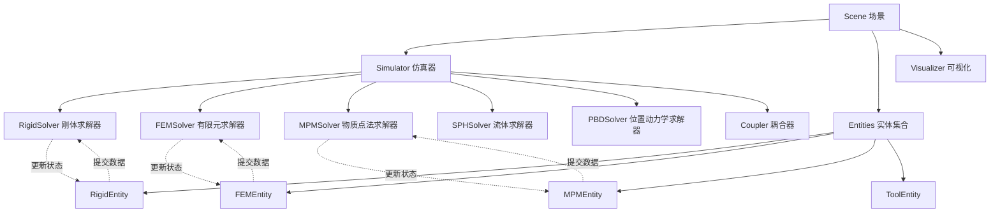
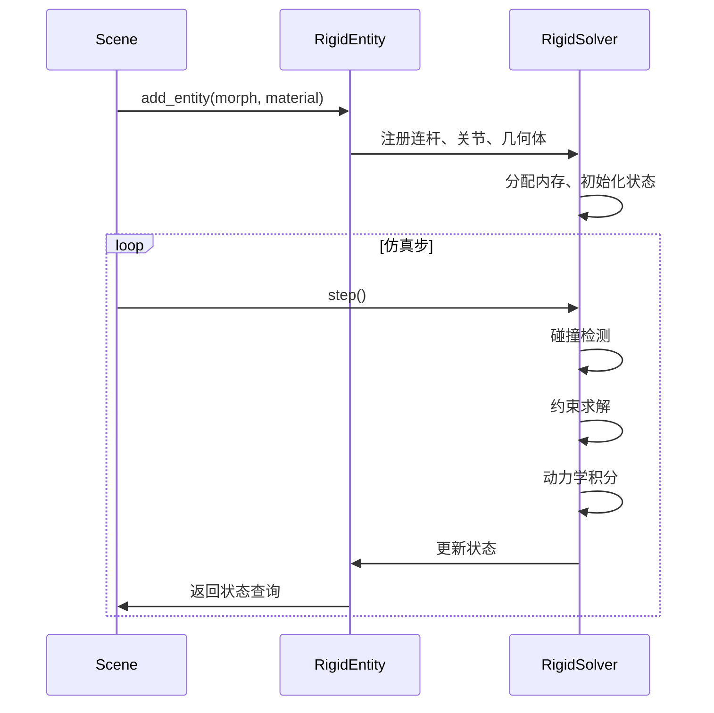

# Entities 核心功能分析
## Core Functionality Analysis
本文档分析由 entities 实现的核心仿真功能，结合 scene.py、simulator.py 和各求解器进行分析。

## 1. 整体架构：Entities 在仿真中的角色



## 2. 刚体求解器相关核心功能

### 2.1 RigidEntity 核心功能

#### 数据组织与管理
- **连杆状态管理**: 位置、四元数、速度、角速度
- **关节状态管理**: 关节角度、速度、力矩
- **几何体管理**: 碰撞几何、视觉几何
- **约束管理**: 等式约束、接触约束

#### 运动学计算
```python
# 核心功能示例
# 1. 正运动学 (Forward Kinematics)
entity.forward_kinematics()  # 从关节角度计算连杆位姿

# 2. 雅可比矩阵计算
J = entity.get_jacobian(link_idx)  # 用于速度映射和控制

# 3. 逆运动学 (Inverse Kinematics)
q = entity.inverse_kinematics(target_pos, target_quat)  # IK 求解
```

#### 动力学积分
- **欧拉积分**: 位置和速度的时间积分
- **广义力计算**: 重力、外力、控制力
- **质量矩阵**: 用于求解加速度

#### 碰撞检测与响应
- **AABB 包围盒**: 粗略碰撞检测
- **GJK/MPR 算法**: 精确碰撞检测
- **接触力计算**: 法向力、摩擦力
- **约束求解**: LCP/PGS 求解器

### 2.2 RigidSolver 与 RigidEntity 的交互



## 3. 有限元求解器相关核心功能

### 3.1 FEMEntity 核心功能

#### 网格与单元管理
- **四面体网格**: 体素化物体为四面体单元
- **节点自由度**: 每个节点 3 个平移自由度
- **单元刚度矩阵**: 基于材料属性计算

#### 变形计算
```python
# FEMEntity 核心操作
# 1. 应力应变计算
stress, strain = entity.compute_stress_strain()

# 2. 内力计算
internal_forces = entity.compute_internal_forces()

# 3. 时间积分（隐式 Newmark）
entity.integrate_newmark(dt)
```

#### 材料模型支持
- **线弹性**: 胡克定律
- **超弹性**: Neo-Hookean、St. Venant-Kirchhoff
- **塑性**: Von Mises 屈服准则

### 3.2 FEMSolver 功能
- **全局刚度矩阵**: 组装所有单元刚度矩阵
- **线性求解器**: 共轭梯度法（CG）
- **碰撞处理**: 与刚体的单向/双向耦合

## 4. 物质点法求解器相关核心功能

### 4.1 MPMEntity 核心功能

#### 粒子与网格管理
- **粒子属性**: 位置、速度、质量、体积、变形梯度
- **背景网格**: 欧拉网格用于计算
- **P2G/G2P**: 粒子到网格、网格到粒子的传递

#### MPM 时间步
```python
# MPM 仿真循环
# 1. Particle-to-Grid (P2G)
solver.particle_to_grid()  # 传递质量、动量到网格

# 2. 网格更新
solver.grid_update()  # 应用外力、边界条件

# 3. Grid-to-Particle (G2P)
solver.grid_to_particle()  # 更新粒子速度、位置

# 4. 粒子更新
solver.particle_update()  # 更新变形梯度、体积
```

#### 材料模型
- **流体**: 弱可压缩流体
- **雪**: Drucker-Prager 塑性
- **沙**: Mohr-Coulomb 模型
- **肌肉**: 各向异性超弹性

## 5. 其他求解器核心功能概述

### 5.1 SPH (光滑粒子流体动力学)
- **密度计算**: 基于核函数的邻域粒子加权
- **压力求解**: 状态方程或不可压缩 SPH
- **粘性力**: 拉普拉斯算子离散化
- **表面张力**: 曲率估计

### 5.2 PBD (位置动力学)
- **位置约束**: 距离、体积、弯曲约束
- **迭代求解**: Gauss-Seidel 迭代
- **布料仿真**: 拉伸、剪切、弯曲约束
- **软体仿真**: 体积保持、形状匹配

## 6. 多物理耦合功能

### 6.1 刚体-软体耦合 (Rigid-Soft Coupling)
- **单向耦合**: 刚体影响软体（如抓取）
- **双向耦合**: 相互作用力（SAP Coupler）

### 6.2 HybridEntity 混合实体
- **刚性骨架 + MPM 软体**: 软体机器人
- **耦合力计算**: 粒子到刚体的力反馈
- **协调更新**: 同步刚体和软体状态

## 7. Entity 核心功能总结表

| Entity | 求解器 | 核心算法 | 主要应用 | 计算复杂度 |
|--------|--------|----------|----------|------------|
| RigidEntity | RigidSolver | 多体动力学、GJK/MPR、LCP | 机器人、刚体仿真 | O(n³) ~ O(n) |
| FEMEntity | FEMSolver | 有限元、隐式积分、CG | 弹性体、结构分析 | O(n²) ~ O(n) |
| MPMEntity | MPMSolver | P2G/G2P、本构模型 | 大变形、多相材料 | O(n) |
| SPHEntity | SPHSolver | 核函数、压力求解 | 流体仿真 | O(n log n) |
| PBDEntity | PBDSolver | 位置约束、迭代求解 | 布料、软体 | O(n) |
| ToolEntity | ToolSolver | 直接控制 | 工具、夹爪 | O(1) |
| HybridEntity | Multi-Solver | 刚柔耦合 | 软体机器人 | O(n) |

---
*生成时间: 2025-10-26*
