# Entity-Solver 交互架构与完整计算流程
# Entity-Solver Interaction Architecture and Complete Computation Flow

本文档详细分析Entity和Solver的交互过程，并提供架构图和完整的计算流程图（包含耦合机制）。

This document provides detailed analysis of Entity-Solver interaction with architecture diagrams and complete computation flow including coupling mechanisms.

---

## 1. 整体架构概览 (Overall Architecture Overview)

### 1.1 三层架构 (Three-Tier Architecture)

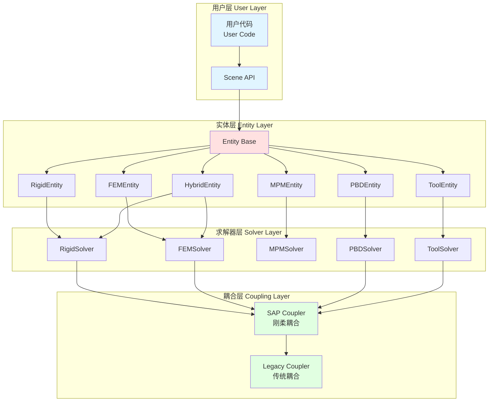

### 1.2 核心交互原则 (Core Interaction Principles)

1. **单向依赖**: Entity 依赖 Solver，Solver 不依赖具体 Entity
2. **状态管理**: Entity 提供状态查询接口，Solver 管理物理状态
3. **批量处理**: Solver 批量处理同类型的所有 Entity
4. **耦合解耦**: 跨Solver交互通过Coupler进行，保持Solver独立性

---

## 2. Entity-Solver 交互详解 (Detailed Entity-Solver Interaction)

### 2.1 RigidEntity-RigidSolver 交互 (最复杂)

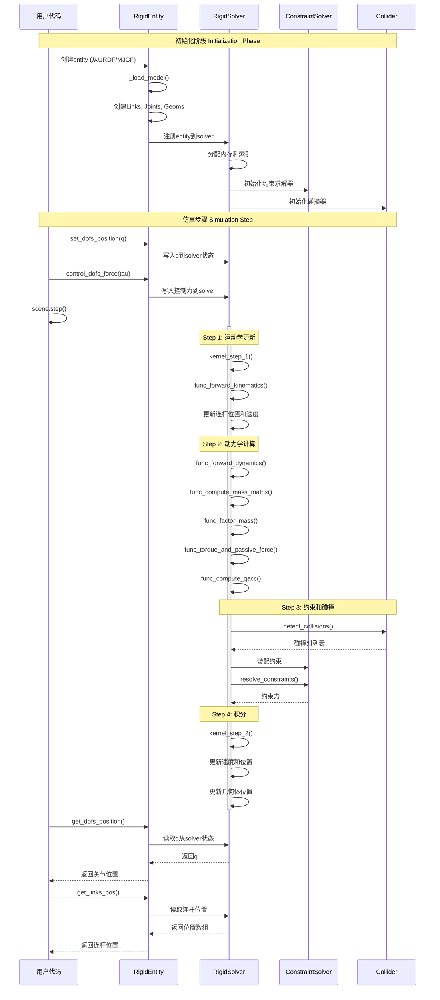

#### 2.1.1 数据流向 (Data Flow)

**Entity → Solver (写入)**:
```
用户设置 → Entity接口 → Solver状态数组
例如:
- set_dofs_position(q) → solver.dofs_state.q[entity_dof_range]
- control_dofs_force(tau) → solver.dofs_state.qf_applied[entity_dof_range]
- set_links_velocity(v) → solver.links_state.vel[entity_link_range]
```

**Solver → Entity (读取)**:
```
Solver状态数组 → Entity接口 → 用户获取
例如:
- solver.links_state.pos[entity_link_range] → get_links_pos() → 用户
- solver.dofs_state.q[entity_dof_range] → get_dofs_position() → 用户
- solver.geoms_state.pos[entity_geom_range] → get_geoms_pos() → 用户
```

#### 2.1.2 RigidSolver 核心计算流程 (Core Computation Pipeline)

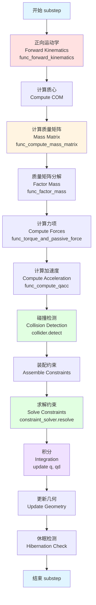

---

### 2.2 FEMEntity-FEMSolver 交互

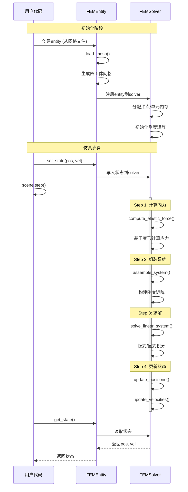

#### 2.2.1 FEMSolver 核心流程

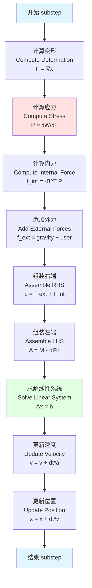

---

### 2.3 MPMEntity-MPMSolver 交互

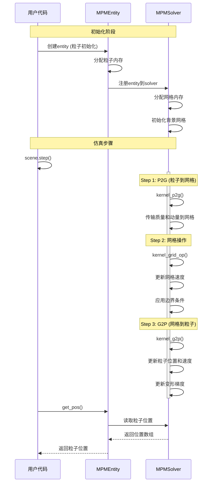

#### 2.3.1 MPMSolver P2G-G2P 流程

```mermaid
graph TD
    Start[开始 substep]
    
    ClearGrid[清空网格<br/>Clear Grid<br/>grid_v = 0, grid_m = 0]
    
    P2G_Mass[P2G: 传输质量<br/>Transfer Mass<br/>grid_m += w * m_p]
    P2G_Mom[P2G: 传输动量<br/>Transfer Momentum<br/>grid_mv += w * m_p * v_p]
    P2G_Force[P2G: 传输力<br/>Transfer Force<br/>grid_f += w * f_p]
    
    GridVel[计算网格速度<br/>Grid Velocity<br/>grid_v = grid_mv / grid_m]
    GridUpdate[更新网格速度<br/>Update Grid Velocity<br/>grid_v += dt * grid_f / grid_m]
    GridBC[应用边界条件<br/>Apply Boundary Conditions]
    
    G2P_Vel[G2P: 更新粒子速度<br/>Update Particle Velocity<br/>v_p = Σ w * grid_v]
    G2P_Pos[G2P: 更新粒子位置<br/>Update Particle Position<br/>x_p += dt * v_p]
    G2P_DefGrad[G2P: 更新变形梯度<br/>Update Deformation Gradient<br/>F_p = (I + dt∇v) * F_p]
    
    End[结束 substep]
    
    Start --> ClearGrid
    ClearGrid --> P2G_Mass
    P2G_Mass --> P2G_Mom
    P2G_Mom --> P2G_Force
    
    P2G_Force --> GridVel
    GridVel --> GridUpdate
    GridUpdate --> GridBC
    
    GridBC --> G2P_Vel
    G2P_Vel --> G2P_Pos
    G2P_Pos --> G2P_DefGrad
    G2P_DefGrad --> End
    
    style Start fill:#e1f5ff
    style End fill:#e1f5ff
    style P2G_Mass fill:#ffe1e1
    style P2G_Mom fill:#ffe1e1
    style GridUpdate fill:#fff4e1
    style G2P_Vel fill:#e1ffe1
    style G2P_Pos fill:#e1ffe1
```

---

### 2.4 PBDEntity-PBDSolver 交互

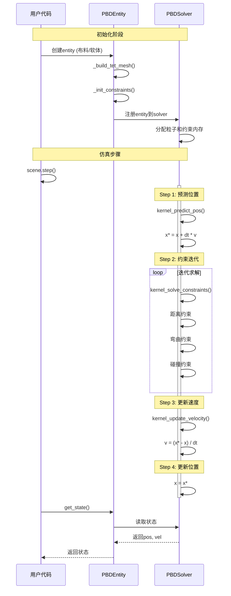

#### 2.4.1 PBDSolver 约束投影流程

```mermaid
graph TD
    Start[开始 substep]
    
    Predict[预测位置<br/>Predict Position<br/>x* = x + dt*v + dt²*f/m]
    
    InitIter[初始化迭代<br/>iter = 0]
    
    SolveDist[求解距离约束<br/>Distance Constraints<br/>|x_i - x_j| = rest_length]
    SolveBend[求解弯曲约束<br/>Bending Constraints<br/>angle = rest_angle]
    SolveVol[求解体积约束<br/>Volume Constraints<br/>V = rest_volume]
    SolveCol[求解碰撞约束<br/>Collision Constraints<br/>penetration > 0]
    
    CheckConv{收敛?<br/>Converged?}
    IncIter[iter++]
    CheckMaxIter{达到最大迭代?}
    
    UpdateVel[更新速度<br/>Update Velocity<br/>v = (x* - x) / dt]
    UpdatePos[更新位置<br/>Update Position<br/>x = x*]
    
    ApplyDamp[应用阻尼<br/>Apply Damping<br/>v *= damping]
    
    End[结束 substep]
    
    Start --> Predict
    Predict --> InitIter
    InitIter --> SolveDist
    SolveDist --> SolveBend
    SolveBend --> SolveVol
    SolveVol --> SolveCol
    SolveCol --> CheckConv
    
    CheckConv -->|否| IncIter
    IncIter --> CheckMaxIter
    CheckMaxIter -->|否| SolveDist
    CheckMaxIter -->|是| UpdateVel
    CheckConv -->|是| UpdateVel
    
    UpdateVel --> UpdatePos
    UpdatePos --> ApplyDamp
    ApplyDamp --> End
    
    style Start fill:#e1f5ff
    style End fill:#e1f5ff
    style Predict fill:#ffe1e1
    style SolveDist fill:#fff4e1
    style SolveBend fill:#fff4e1
    style UpdateVel fill:#e1ffe1
```

---

### 2.5 ToolEntity-ToolSolver 交互

ToolEntity 比较特殊，它在 Entity 层面就实现了大量的物理更新逻辑：

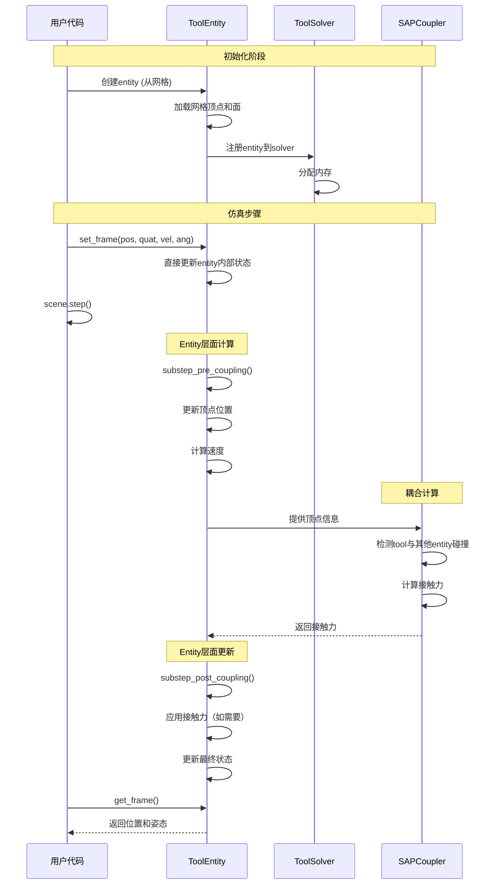

**特点**: ToolEntity 在 entity 层面实现了22个 `@ti.kernel` 函数，大部分物理更新逻辑不需要经过 ToolSolver

---

## 3. 跨Solver耦合机制 (Cross-Solver Coupling)

### 3.1 SAP Coupler 架构

SAP (Sweep and Prune) Coupler 负责处理不同 Solver 之间的交互，主要包括：
- Rigid-FEM 刚柔耦合
- Rigid-PBD 刚体-软体耦合
- FEM-Floor 柔体-地面碰撞
- Tool-Other entity 工具与其他物体交互

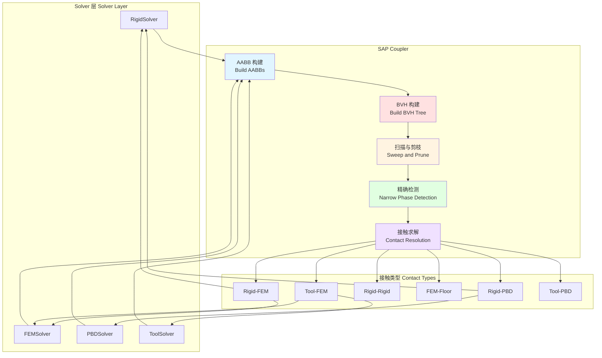

### 3.2 完整的多物理仿真流程（含耦合）

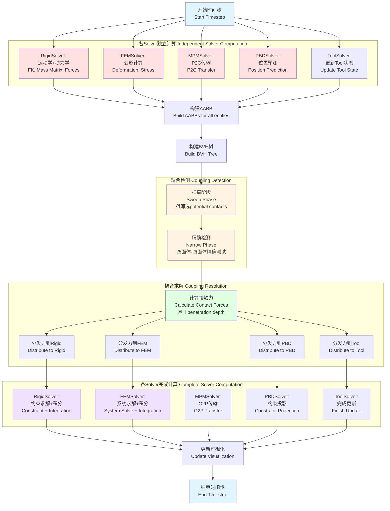

### 3.3 刚柔耦合详细流程 (Rigid-FEM Coupling Detail)

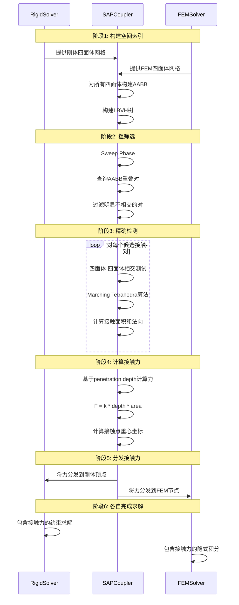

### 3.4 HybridEntity 的特殊处理

HybridEntity 结合了刚体和柔体，需要同时与 RigidSolver 和 FEMSolver 交互：

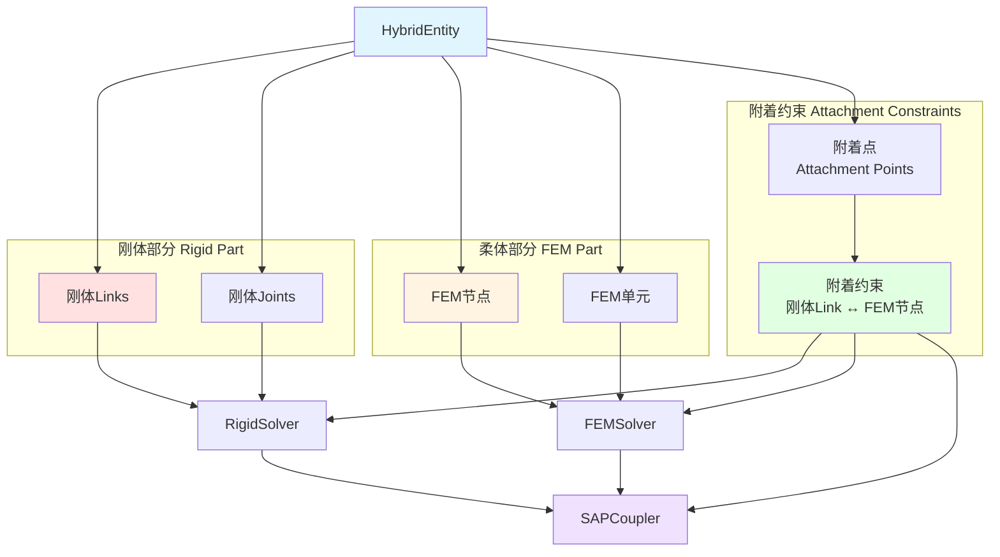

---

## 4. 关键数据结构 (Key Data Structures)

### 4.1 Solver 状态数组 (Solver State Arrays)

每个 Solver 维护结构化数组 (Structure of Arrays, SoA) 存储所有实体的状态：

```python
# RigidSolver 状态
class RigidSolverState:
    # 连杆状态 Link State (n_links)
    links_state.pos: ti.field(ti.math.vec3)      # 位置
    links_state.quat: ti.field(ti.math.vec4)     # 四元数
    links_state.vel: ti.field(ti.math.vec3)      # 线速度
    links_state.ang: ti.field(ti.math.vec3)      # 角速度
    
    # 自由度状态 DOF State (n_dofs)
    dofs_state.q: ti.field(ti.f32)               # 关节位置
    dofs_state.qd: ti.field(ti.f32)              # 关节速度
    dofs_state.qacc: ti.field(ti.f32)            # 关节加速度
    dofs_state.qf_applied: ti.field(ti.f32)      # 外力
    dofs_state.qf_constraint: ti.field(ti.f32)   # 约束力
    
    # 几何状态 Geom State (n_geoms)
    geoms_state.pos: ti.field(ti.math.vec3)      # 几何中心
    geoms_state.quat: ti.field(ti.math.vec4)     # 几何方向
```

```python
# FEMSolver 状态
class FEMSolverState:
    # 节点状态 Node State (n_nodes)
    nodes_state.pos: ti.field(ti.math.vec3)      # 当前位置
    nodes_state.vel: ti.field(ti.math.vec3)      # 速度
    nodes_state.force: ti.field(ti.math.vec3)    # 受力
    nodes_state.rest_pos: ti.field(ti.math.vec3) # 静态位置
    
    # 单元状态 Element State (n_elements)
    elements.vertices: ti.field(ti.i32, shape=4)  # 四面体顶点索引
    elements.F: ti.field(ti.math.mat3)            # 变形梯度
    elements.stress: ti.field(ti.math.mat3)       # 应力张量
```

```python
# MPMSolver 状态
class MPMSolverState:
    # 粒子状态 Particle State (n_particles)
    particles.pos: ti.field(ti.math.vec3)        # 位置
    particles.vel: ti.field(ti.math.vec3)        # 速度
    particles.F: ti.field(ti.math.mat3)          # 变形梯度
    particles.C: ti.field(ti.math.mat3)          # APIC矩阵
    particles.mass: ti.field(ti.f32)             # 质量
    
    # 网格状态 Grid State (grid_size^3)
    grid.v: ti.field(ti.math.vec3)               # 网格速度
    grid.m: ti.field(ti.f32)                     # 网格质量
```

### 4.2 Entity 索引范围 (Entity Index Ranges)

每个 Entity 存储其在 Solver 状态数组中的索引范围：

```python
class RigidEntity:
    _link_start: int       # 连杆起始索引
    _link_end: int         # 连杆结束索引（不含）
    _joint_start: int      # 关节起始索引
    _dof_start: int        # 自由度起始索引
    _geom_start: int       # 几何起始索引
    
    # 访问示例
    def get_links_pos(self):
        return self._solver.links_state.pos[self._link_start:self._link_end]
```

这种设计允许：
1. **批量处理**: Solver 可以高效地处理所有实体
2. **并行计算**: GPU kernel 可以并行访问数组
3. **清晰边界**: Entity 通过索引范围访问自己的数据

---

## 5. 总结 (Summary)

### 5.1 Entity-Solver 交互模式

1. **初始化**: Entity 加载模型 → 注册到 Solver → Solver 分配内存
2. **输入**: 用户 → Entity API → Solver 状态数组
3. **计算**: Solver 批量处理所有 Entity → 更新状态数组
4. **输出**: Solver 状态数组 → Entity API → 用户
5. **耦合**: SAPCoupler 协调跨 Solver 交互

### 5.2 设计优势

✅ **性能优化**: 批量处理 + GPU 并行  
✅ **清晰分层**: 用户层 → Entity 层 → Solver 层  
✅ **灵活扩展**: 新 Entity 类型易于添加  
✅ **多物理支持**: 通过 Coupler 实现跨 Solver 交互

### 5.3 关键组件职责

| 组件 | 职责 |
|------|------|
| **Entity** | 提供用户API，管理索引范围，数据访问接口 |
| **Solver** | 批量物理计算，状态更新，内存管理 |
| **Coupler** | 跨Solver交互，碰撞检测，接触求解 |
| **Scene** | 协调所有组件，驱动仿真循环 |

---

*生成时间: 2025-10-26*
*分析范围: genesis/engine/entities 和 genesis/engine/solvers*
