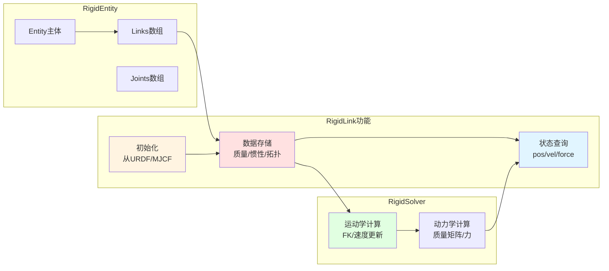
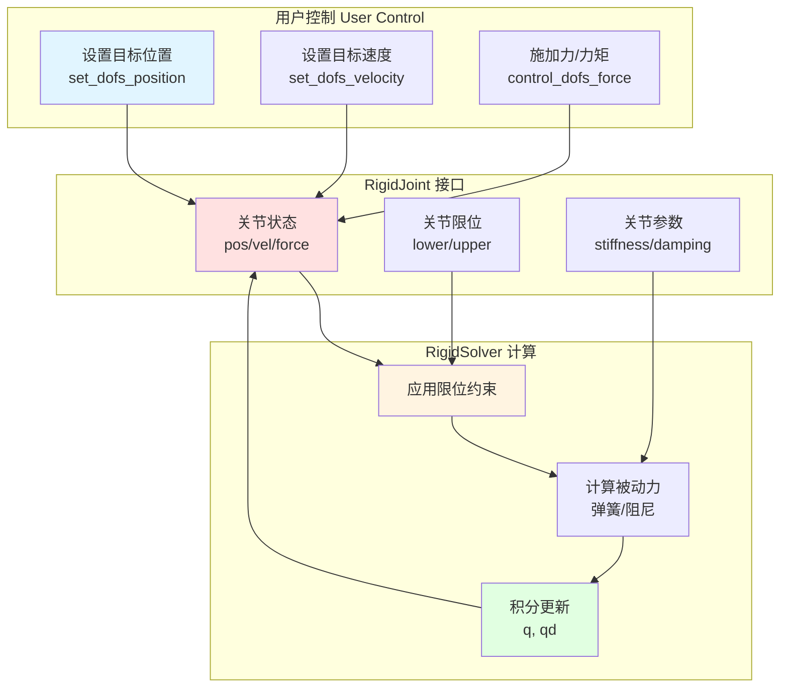
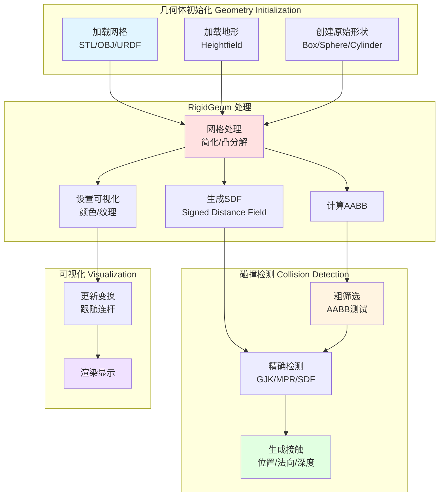
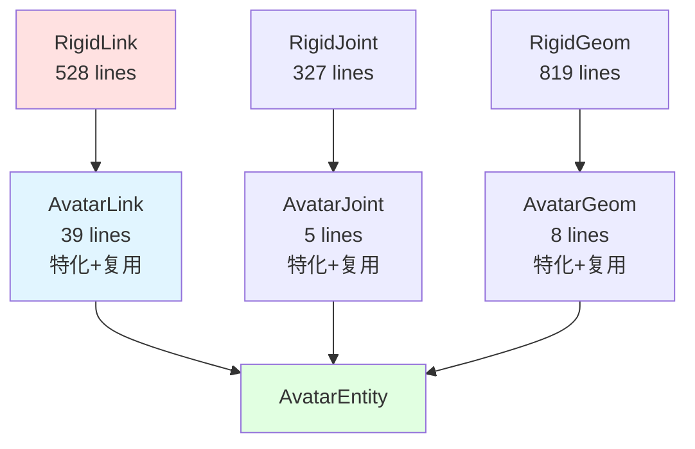
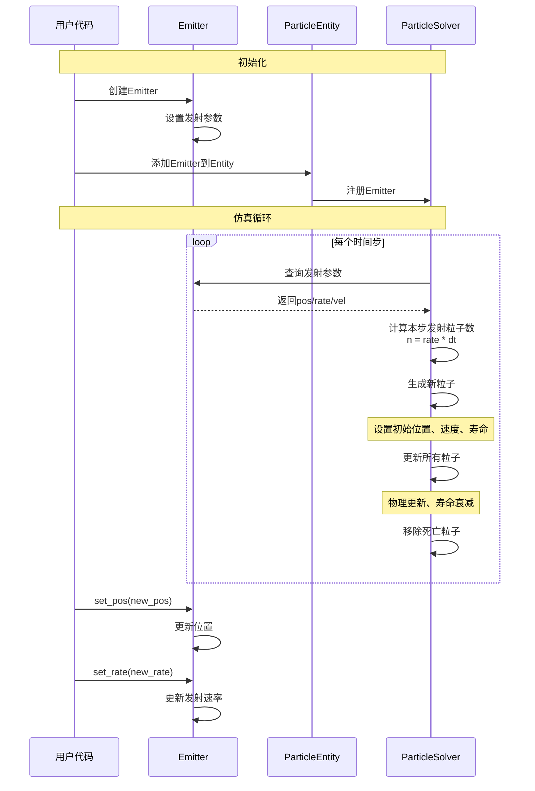
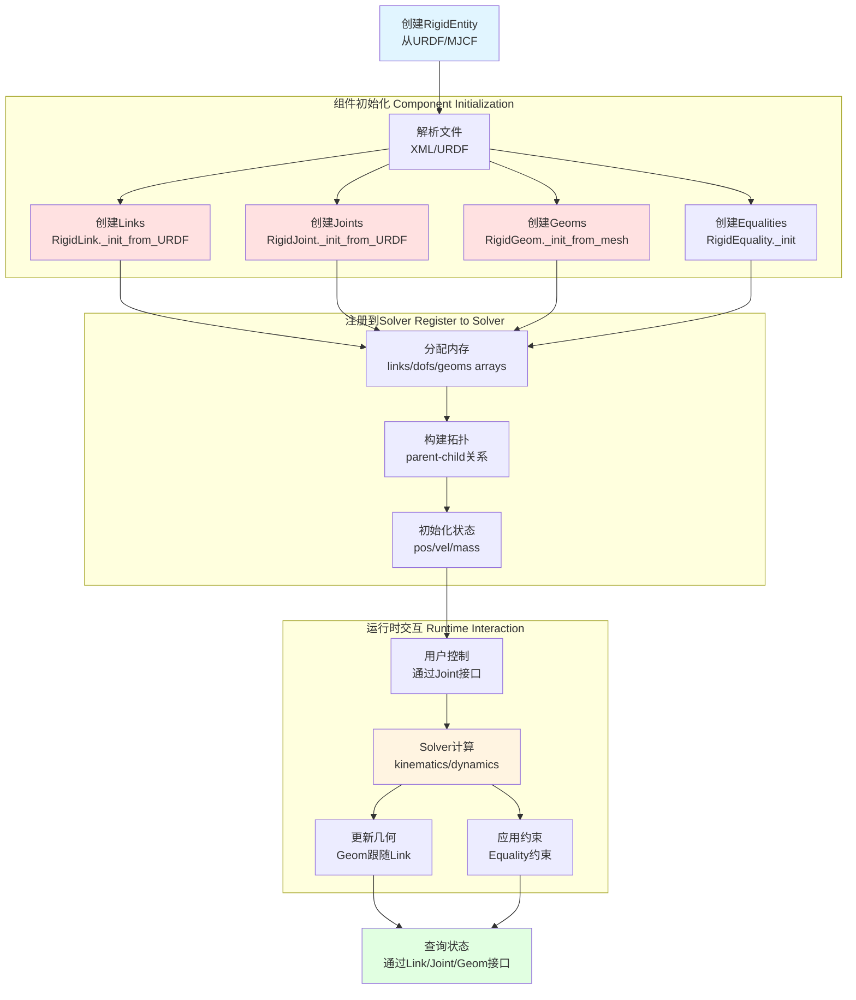
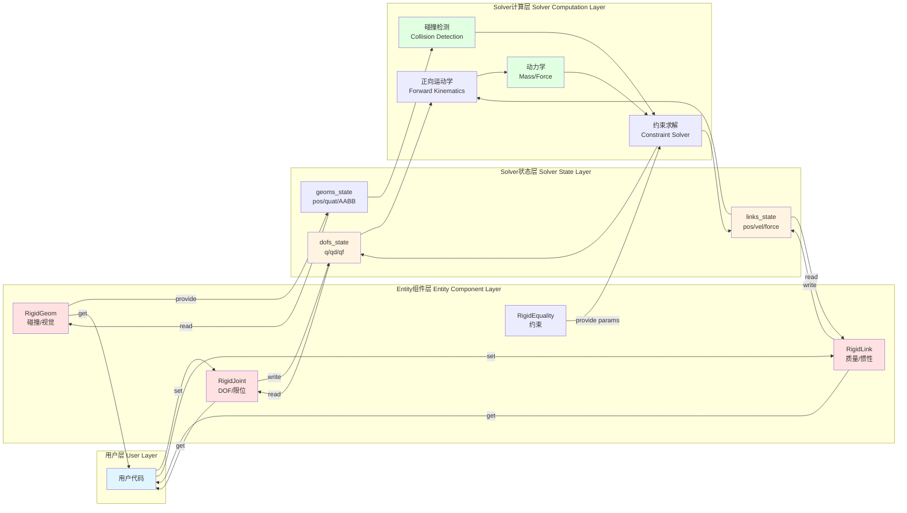

# Entity 辅助组件分析
# Entity Auxiliary Components Analysis

本文档分析 entities 目录中的非主 entity 文件，包括发射器 (Emitter)、连杆 (Link)、关节 (Joint)、几何体 (Geom) 等，给出其函数分布比例（按代码量）、在对应 entity 计算过程中发挥的功能，以及交互过程的流程图。

This document analyzes auxiliary components in the entities directory, including Emitter, Link, Joint, Geom, etc., providing their function distribution (by code volume), roles in entity computation, and interaction flow diagrams.

---

## 1. 组件概览 (Components Overview)

### 1.1 组件分类 (Component Classification)

Genesis 的 Entity 系统采用组件化设计，特别是在 Rigid 系统中：

```
RigidEntity (主实体)
├── RigidLink (连杆组件)
├── RigidJoint (关节组件)
├── RigidGeom (几何组件)
├── RigidEquality (约束组件)
└── [多个Link, Joint, Geom实例]

AvatarEntity (继承RigidEntity)
├── AvatarLink (特化Link)
├── AvatarJoint (特化Joint)
└── AvatarGeom (特化Geom)

ToolEntity (独立实体)
└── Mesh (网格组件)

其他工具类
└── Emitter (粒子发射器)
```

### 1.2 组件统计表 (Component Statistics Table)

| 组件 | 文件 | 总行数 | 代码行数 | 功能数 | 所属系统 |
|------|------|--------|----------|--------|----------|
| **RigidLink** | rigid_link.py | 747 | 528 | 65 | Rigid |
| **RigidJoint** | rigid_joint.py | 475 | 327 | 47 | Rigid |
| **RigidGeom** | rigid_geom.py | 1,129 | 819 | 107 | Rigid |
| **RigidEquality** | rigid_equality.py | 158 | 95 | 14 | Rigid |
| **AvatarLink** | avatar_link.py | 46 | 39 | 3 | Avatar |
| **AvatarJoint** | avatar_joint.py | 11 | 5 | 1 | Avatar |
| **AvatarGeom** | avatar_geom.py | 16 | 8 | 1 | Avatar |
| **Mesh** | mesh.py | 209 | 153 | 12 | Tool |
| **Emitter** | emitter.py | 307 | 158 | 10 | Utility |

---

## 2. RigidLink (刚体连杆)

### 2.1 代码分布 (Code Distribution)

**文件**: `rigid_entity/rigid_link.py`  
**总代码行数**: 528 行  
**函数总行数**: 510 行

| 类别 | 函数数 | 代码行数 | 占比 | 说明 |
|------|--------|----------|------|------|
| 基础功能 | 58 | 287 | 56.3% | 大量属性访问器 |
| 计算细节 | 1 | 10 | 2.0% | 单个kernel函数 |
| 辅助函数 | 6 | 213 | 41.8% | 初始化和构建相关 |

### 2.2 核心功能 (Core Functionality)

RigidLink 表示刚体系统中的一个连杆（刚体部件），包含以下核心数据：

**物理属性**:
- 质量 (mass)
- 惯性张量 (inertia)
- 质心位置 (center of mass)

**运动学状态**:
- 位置 (pos)
- 四元数方向 (quat)
- 线速度 (vel)
- 角速度 (ang)

**拓扑关系**:
- 父连杆 (parent)
- 子连杆 (children)
- 连接关节 (joint)

### 2.3 代表性函数分析

#### 2.3.1 基础功能 (56.3%)

```python
@property
def pos(self) -> array_class.Array3:
    """连杆位置 - 查询solver状态"""
    return self.entity._solver.links_state.pos[self.idx]

@property
def quat(self) -> array_class.Array4:
    """连杆四元数 - 查询solver状态"""
    return self.entity._solver.links_state.quat[self.idx]

@property
def mass(self) -> float:
    """连杆质量 - 静态属性"""
    return self.entity._solver.links_info.mass[self.idx]
```

**特点**: 58个属性和getter方法，提供丰富的连杆信息访问接口

#### 2.3.2 辅助函数 (41.8%)

```python
def _init_from_URDF(self, link_info, ...):
    """从URDF格式初始化连杆 (~60行)"""
    # 解析URDF link元素
    # 设置质量、惯性、碰撞、视觉属性
    # 处理坐标变换
    pass

def _init_from_MJCF(self, body_info, ...):
    """从MJCF格式初始化连杆 (~50行)"""
    # 解析MJCF body元素
    # 设置物理属性
    # 处理坐标系统差异
    pass

def _init_dummy_link(self):
    """初始化虚拟连杆 (~30行)"""
    # 用于world frame等特殊连杆
    pass
```

**特点**: 辅助函数占比高达41.8%，主要用于从不同格式（URDF、MJCF、原始数据）初始化连杆

#### 2.3.3 计算细节 (2.0%)

```python
@ti.kernel
def _kernel_compute_something(self):
    """单个GPU计算核心"""
    # 少量的连杆层面计算
    pass
```

**特点**: 计算核心很少，大部分计算在RigidSolver中完成

### 2.4 在 Entity 计算中的作用 (Role in Entity Computation)



**关键角色**:
1. **数据容器**: 存储连杆的物理属性和拓扑关系
2. **状态接口**: 提供连杆状态的查询接口
3. **初始化器**: 从各种格式加载连杆配置

---

## 3. RigidJoint (刚体关节)

### 3.1 代码分布 (Code Distribution)

**文件**: `rigid_entity/rigid_joint.py`  
**总代码行数**: 327 行  
**函数总行数**: 297 行

| 类别 | 函数数 | 代码行数 | 占比 | 说明 |
|------|--------|----------|------|------|
| 基础功能 | 43 | 234 | 78.8% | 关节属性访问 |
| 计算细节 | 2 | 8 | 2.7% | 两个简单的kernel |
| 辅助函数 | 2 | 55 | 18.5% | 初始化函数 |

### 3.2 核心功能 (Core Functionality)

RigidJoint 表示连接两个连杆的关节，定义运动约束：

**关节类型**:
- `hinge` - 旋转关节 (1 DOF)
- `slide` - 滑动关节 (1 DOF)
- `ball` - 球形关节 (3 DOF)
- `free` - 自由关节 (6 DOF)
- `fixed` - 固定关节 (0 DOF)

**关节属性**:
- 自由度 (DOF) 配置
- 关节限位 (position limits)
- 控制参数 (stiffness, damping)
- 驱动力/力矩

**关节状态**:
- 关节位置 (q)
- 关节速度 (qd)
- 关节力 (qf)

### 3.3 代表性函数分析

#### 3.3.1 基础功能 (78.8%)

```python
@property
def pos(self) -> array_class.ArrayBase:
    """关节位置（角度或位移）"""
    return self._solver.dofs_state.q[self._dof_start:self._dof_end]

@property
def vel(self) -> array_class.ArrayBase:
    """关节速度"""
    return self._solver.dofs_state.qd[self._dof_start:self._dof_end]

@property
def force(self) -> array_class.ArrayBase:
    """关节力/力矩"""
    return self._solver.dofs_state.qf[self._dof_start:self._dof_end]

def get_dof_limit_lower(self) -> np.ndarray:
    """获取关节下限"""
    return self._solver.dofs_info.limit_lower[self._dof_start:self._dof_end]

def get_dof_limit_upper(self) -> np.ndarray:
    """获取关节上限"""
    return self._solver.dofs_info.limit_upper[self._dof_start:self._dof_end]
```

**特点**: 43个属性和getter方法，提供全面的关节信息访问

#### 3.3.2 辅助函数 (18.5%)

```python
def _init_from_URDF(self, joint_elem, ...):
    """从URDF初始化关节 (~30行)"""
    # 解析关节类型 (revolute, prismatic, etc.)
    # 设置轴向、限位、动力学参数
    # 处理坐标变换
    pass

def _init_from_MJCF(self, joint_elem, ...):
    """从MJCF初始化关节 (~25行)"""
    # 解析MJCF关节定义
    # 设置关节参数
    pass
```

### 3.4 在 Entity 计算中的作用 (Role in Entity Computation)



**关键角色**:
1. **约束定义**: 定义连杆间的运动约束类型和自由度
2. **控制接口**: 提供关节控制的入口（位置、速度、力控制）
3. **限位管理**: 管理关节的运动范围限制
4. **参数存储**: 存储关节的物理参数（刚度、阻尼等）

---

## 4. RigidGeom (刚体几何)

### 4.1 代码分布 (Code Distribution)

**文件**: `rigid_entity/rigid_geom.py`  
**总代码行数**: 819 行  
**函数总行数**: 736 行

| 类别 | 函数数 | 代码行数 | 占比 | 说明 |
|------|--------|----------|------|------|
| 基础功能 | 91 | 447 | 60.7% | 几何属性查询 |
| 计算细节 | 6 | 26 | 3.5% | 几何计算kernel |
| 辅助函数 | 10 | 263 | 35.7% | 几何体构建和处理 |

### 4.2 核心功能 (Core Functionality)

RigidGeom 管理刚体的碰撞和视觉几何：

**几何类型**:
- 原始形状: box, sphere, cylinder, capsule, plane
- 复杂几何: mesh, heightfield (地形)
- SDF (Signed Distance Field) 支持

**几何属性**:
- 位置和方向
- 碰撞参数 (friction, restitution)
- 视觉参数 (color, texture)
- AABB (Axis-Aligned Bounding Box)

**用途**:
- **碰撞检测**: 用于物理碰撞
- **可视化**: 用于渲染显示

### 4.3 代表性函数分析

#### 4.3.1 基础功能 (60.7%)

```python
@property
def pos(self) -> array_class.Array3:
    """几何体位置"""
    return self._solver.geoms_state.pos[self.idx]

@property
def quat(self) -> array_class.Array4:
    """几何体方向"""
    return self._solver.geoms_state.quat[self.idx]

@property
def friction(self) -> float:
    """摩擦系数"""
    return self._solver.geoms_info.friction[self.idx]

def get_AABB(self) -> np.ndarray:
    """获取轴对齐包围盒 [min_x, min_y, min_z, max_x, max_y, max_z]"""
    return self._solver.geoms_info.AABB[self.idx]

@property
def type(self) -> str:
    """几何类型: 'box', 'sphere', 'mesh', etc."""
    return self._solver.geoms_info.type[self.idx]
```

**特点**: 91个属性和查询方法，提供详细的几何信息

#### 4.3.2 辅助函数 (35.7%)

```python
def _init_from_mesh(self, mesh_path, scale, ...):
    """从网格文件初始化 (~60行)"""
    # 加载STL/OBJ等网格文件
    # 计算AABB
    # 生成碰撞网格（简化）
    # 生成SDF（如需要）
    pass

def _init_from_terrain(self, terrain_data, ...):
    """从地形数据初始化 (~50行)"""
    # 生成heightfield
    # 创建三角面片网格
    # 计算法向量
    pass

def _init_from_primitive(self, geom_type, size, ...):
    """从原始形状初始化 (~40行)"""
    # box, sphere, cylinder等
    # 生成顶点和面
    # 计算几何参数
    pass

def _process_collision_mesh(self, mesh):
    """处理碰撞网格 (~35行)"""
    # 简化网格
    # 凸分解
    # 优化拓扑
    pass
```

**特点**: 辅助函数占比达35.7%，处理各种复杂的几何体类型

#### 4.3.3 计算细节 (3.5%)

```python
@ti.kernel
def _kernel_update_vertices(self):
    """更新顶点位置 (~5行)"""
    # 根据连杆变换更新几何顶点
    pass

@ti.kernel
def _kernel_compute_AABB(self):
    """计算AABB (~8行)"""
    # 基于顶点计算包围盒
    pass
```

### 4.4 在 Entity 计算中的作用 (Role in Entity Computation)



**关键角色**:
1. **碰撞几何**: 提供碰撞检测所需的几何信息
2. **AABB管理**: 用于碰撞粗筛选的快速包围盒
3. **SDF支持**: 高精度碰撞检测的有符号距离场
4. **可视化网格**: 用于渲染显示的视觉几何

---

## 5. RigidEquality (刚体约束)

### 5.1 代码分布 (Code Distribution)

**文件**: `rigid_entity/rigid_equality.py`  
**总代码行数**: 95 行  
**函数总行数**: 82 行

| 类别 | 函数数 | 代码行数 | 占比 | 说明 |
|------|--------|----------|------|------|
| 基础功能 | 13 | 60 | 73.2% | 约束参数访问 |
| 辅助函数 | 1 | 22 | 26.8% | 初始化函数 |

### 5.2 核心功能 (Core Functionality)

RigidEquality 表示刚体系统中的等式约束：

**约束类型**:
- `weld` - 焊接约束：完全固定两个连杆的相对位置
- `attach` - 附着点约束：将一个点固定在另一个连杆上

**约束参数**:
- 约束的两个连杆
- 约束点的局部坐标
- 约束刚度和阻尼

### 5.3 在 Entity 计算中的作用

```mermaid
graph LR
    subgraph "约束定义 Constraint Definition"
        WeldDef[焊接约束<br/>Weld Constraint]
        AttachDef[附着约束<br/>Attach Constraint]
    end
    
    subgraph "RigidEquality"
        StoreParams[存储参数<br/>links/points/stiffness]
        QueryInterface[查询接口<br/>get parameters]
    end
    
    subgraph "ConstraintSolver"
        AssembleJac[组装雅可比<br/>Jacobian]
        SolveSystem[求解约束<br/>λ = (J M^-1 J^T)^-1 b]
        ApplyForce[应用约束力<br/>f = J^T λ]
    end
    
    WeldDef --> StoreParams
    AttachDef --> StoreParams
    StoreParams --> QueryInterface
    QueryInterface --> AssembleJac
    AssembleJac --> SolveSystem
    SolveSystem --> ApplyForce
    
    style WeldDef fill:#e1f5ff
    style StoreParams fill:#ffe1e1
    style SolveSystem fill:#e1ffe1
```

**关键角色**:
1. **约束存储**: 存储等式约束的定义和参数
2. **约束接口**: 提供约束信息查询接口给ConstraintSolver
3. **辅助建模**: 简化复杂刚体系统的建模（如焊接多个部件）

---

## 6. Avatar 组件 (AvatarLink, AvatarJoint, AvatarGeom)

### 6.1 代码分布 (Code Distribution)

| 组件 | 总行数 | 代码行数 | 函数数 |
|------|--------|----------|--------|
| AvatarLink | 46 | 39 | 3 |
| AvatarJoint | 11 | 5 | 1 |
| AvatarGeom | 16 | 8 | 1 |

### 6.2 核心功能 (Core Functionality)

Avatar 组件是 Rigid 组件的轻量级特化版本，主要区别：

**AvatarLink**:
- 继承自 RigidLink
- 添加人形角色特有属性
- 支持动作捕捉数据驱动

**AvatarJoint**:
- 继承自 RigidJoint
- 人形关节的特化配置
- 优化的关节限位

**AvatarGeom**:
- 继承自 RigidGeom
- 人形身体部位的几何
- 简化的碰撞表示

### 6.3 设计特点



**优势**: 通过继承大量复用Rigid组件的功能，只需少量代码实现特化

---

## 7. Mesh (工具网格组件)

### 7.1 代码分布 (Code Distribution)

**文件**: `tool_entity/mesh.py`  
**总代码行数**: 153 行  
**函数总行数**: 162 行

| 类别 | 函数数 | 代码行数 | 占比 | 说明 |
|------|--------|----------|------|------|
| 基础功能 | 11 | 153 | 94.4% | 网格数据访问 |
| 辅助函数 | 1 | 9 | 5.6% | 构建函数 |

### 7.2 核心功能 (Core Functionality)

Mesh 是 ToolEntity 的组件，管理网格数据：

**网格数据**:
- 顶点位置 (vertices)
- 面索引 (faces)
- 边索引 (edges)
- 法向量 (normals)

**用途**:
- 提供Tool的几何表示
- 支持碰撞检测
- 可视化渲染

### 7.3 代表性函数分析

```python
@property
def verts(self) -> array_class.ArrayBase:
    """顶点数组"""
    return self._solver.verts[self._vert_start:self._vert_end]

@property
def faces(self) -> array_class.ArrayBase:
    """面索引数组"""
    return self._solver.faces[self._face_start:self._face_end]

@property
def n_verts(self) -> int:
    """顶点数量"""
    return self._vert_end - self._vert_start

@property
def n_faces(self) -> int:
    """面数量"""
    return self._face_end - self._face_start
```

### 7.4 在 ToolEntity 中的作用

```mermaid
graph LR
    subgraph "Mesh组件 Mesh Component"
        LoadMesh[加载网格文件<br/>OBJ/STL]
        StoreMesh[存储网格数据<br/>verts/faces/edges]
        QueryMesh[查询网格<br/>verts/faces]
    end
    
    subgraph "ToolEntity"
        UpdateVerts[更新顶点位置<br/>根据Tool变换]
        ComputeVel[计算顶点速度<br/>v = (x_new - x_old) / dt]
    end
    
    subgraph "碰撞与可视化"
        Collision[碰撞检测<br/>与其他entity]
        Render[渲染显示<br/>Tool可视化]
    end
    
    LoadMesh --> StoreMesh
    StoreMesh --> QueryMesh
    QueryMesh --> UpdateVerts
    UpdateVerts --> ComputeVel
    ComputeVel --> Collision
    QueryMesh --> Render
    
    style LoadMesh fill:#e1f5ff
    style StoreMesh fill:#ffe1e1
    style UpdateVerts fill:#fff4e1
    style Collision fill:#e1ffe1
```

**关键角色**:
1. **网格存储**: 存储Tool的三角网格数据
2. **数据接口**: 提供网格数据的查询接口
3. **轻量级设计**: 只包含必要的网格数据，不含复杂处理逻辑

---

## 8. Emitter (粒子发射器)

### 8.1 代码分布 (Code Distribution)

**文件**: `emitter.py`  
**总代码行数**: 158 行  
**函数总行数**: 247 行

| 类别 | 函数数 | 代码行数 | 占比 | 说明 |
|------|--------|----------|------|------|
| 基础功能 | 9 | 237 | 96.0% | 发射器参数访问 |
| 辅助函数 | 1 | 10 | 4.0% | 初始化函数 |

### 8.2 核心功能 (Core Functionality)

Emitter 是粒子系统的发射器，用于动态生成粒子：

**发射参数**:
- 发射位置和方向
- 发射速率 (particles per second)
- 粒子初始速度
- 粒子寿命

**发射形状**:
- 点发射 (point)
- 区域发射 (box, sphere)
- 方向发射 (cone, plane)

**应用场景**:
- 流体效果（水流、喷泉）
- 粒子效果（烟雾、火焰）
- 动态物体生成

### 8.3 代表性函数分析

```python
@property
def pos(self) -> array_class.Array3:
    """发射器位置"""
    return self._pos

@property
def direction(self) -> array_class.Array3:
    """发射方向"""
    return self._direction

@property
def rate(self) -> float:
    """发射速率 (particles/second)"""
    return self._rate

@property
def velocity(self) -> float:
    """粒子初始速度"""
    return self._velocity

def set_pos(self, pos):
    """设置发射器位置"""
    self._pos = pos

def set_rate(self, rate):
    """设置发射速率"""
    self._rate = rate
```

### 8.4 与粒子系统的交互



**关键角色**:
1. **参数存储**: 存储粒子发射的配置参数
2. **动态控制**: 允许运行时修改发射参数
3. **接口简单**: 提供简洁的API给粒子系统

---

## 9. 组件交互完整流程 (Complete Component Interaction Flow)

### 9.1 RigidEntity 组件协作流程



### 9.2 组件间数据流向



---

## 10. 组件设计总结 (Component Design Summary)

### 10.1 设计模式分析

#### 10.1.1 数据访问组件 (Data Access Components)

**特征**: 基础功能占比 > 70%

**组件**: RigidJoint (78.8%), RigidEquality (73.2%), Mesh (94.4%), Emitter (96.0%)

**设计理念**:
- 组件主要作为数据容器
- 提供丰富的getter/setter接口
- 计算逻辑在Solver或Entity中

**优点**:
- 职责清晰
- 易于使用
- 便于测试

#### 10.1.2 复杂初始化组件 (Complex Initialization Components)

**特征**: 辅助函数占比 > 30%

**组件**: RigidLink (41.8%), RigidGeom (35.7%)

**设计理念**:
- 需要从多种格式加载数据（URDF, MJCF, 网格文件等）
- 需要复杂的预处理（网格简化、凸分解、SDF生成等）
- 初始化逻辑封装在组件内部

**优点**:
- 隐藏复杂性
- 支持多种数据格式
- 易于扩展新格式

#### 10.1.3 轻量级特化组件 (Lightweight Specialized Components)

**特征**: 代码量很小，主要复用父类

**组件**: AvatarLink (39行), AvatarJoint (5行), AvatarGeom (8行)

**设计理念**:
- 通过继承复用大量功能
- 只添加必要的特化逻辑
- 保持代码简洁

**优点**:
- 代码复用率高
- 维护成本低
- 易于理解

### 10.2 组件职责矩阵 (Component Responsibility Matrix)

| 组件 | 数据存储 | 状态查询 | 初始化 | 计算 | 碰撞 | 可视化 |
|------|---------|---------|--------|------|------|--------|
| **RigidLink** | ⭐⭐⭐ | ⭐⭐⭐ | ⭐⭐⭐ | ⭐ | - | - |
| **RigidJoint** | ⭐⭐⭐ | ⭐⭐⭐ | ⭐⭐ | ⭐ | - | - |
| **RigidGeom** | ⭐⭐⭐ | ⭐⭐⭐ | ⭐⭐⭐ | ⭐ | ⭐⭐⭐ | ⭐⭐⭐ |
| **RigidEquality** | ⭐⭐⭐ | ⭐⭐ | ⭐ | - | - | - |
| **Mesh** | ⭐⭐⭐ | ⭐⭐⭐ | ⭐ | - | ⭐⭐ | ⭐⭐⭐ |
| **Emitter** | ⭐⭐⭐ | ⭐⭐ | ⭐ | - | - | - |

⭐⭐⭐ 核心职责 | ⭐⭐ 重要职责 | ⭐ 辅助职责 | - 不涉及

### 10.3 关键发现 (Key Findings)

1. **清晰的职责分离**:
   - 组件负责数据存储和接口
   - Solver负责物理计算
   - Entity负责协调和管理

2. **高度的代码复用**:
   - Avatar组件通过继承复用Rigid组件
   - 避免重复代码，保持一致性

3. **灵活的初始化**:
   - 支持多种数据格式（URDF, MJCF, 原始数据）
   - 复杂的预处理逻辑封装在组件内部

4. **最小化计算**:
   - 组件层面的计算很少（< 5%）
   - 主要计算在Solver的GPU kernel中
   - 保持组件轻量级

5. **丰富的接口**:
   - 大量的getter方法提供全面的状态查询
   - 清晰的API便于用户使用

---

*生成时间: 2025-10-26*
*分析范围: genesis/engine/entities 中的辅助组件*
*分析工具: Python AST静态分析 + 代码审查*
